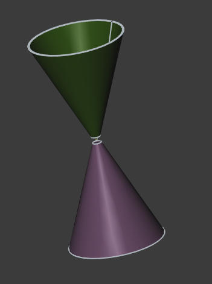

# Design, simulate and construction of an asymetric biconical antenna for SDR

# WIP 

Reading different articlie come on [Design of an asymmetric capped biconical antenna for constant beam direction over a desired range of frequencies](https://www.sciencedirect.com/science/article/abs/pii/S1434841117320009)

## 3D modeling on FreeCAD

Using the FreeCAD v1.0 an asymetric biconical antenna have been designed. The diamentions are set by a variable set named __VarSet002__

## Simulation with openEMS

Using the [FreeCAD-OpenEMS-Export](https://github.com/LubomirJagos42/FreeCAD-OpenEMS-Export) to generate the python script to be used with the openEMS to simulate the antenna.

I run the simulation on Debian machine with 64GB of RAM. The openEMS needs ~47GB.
